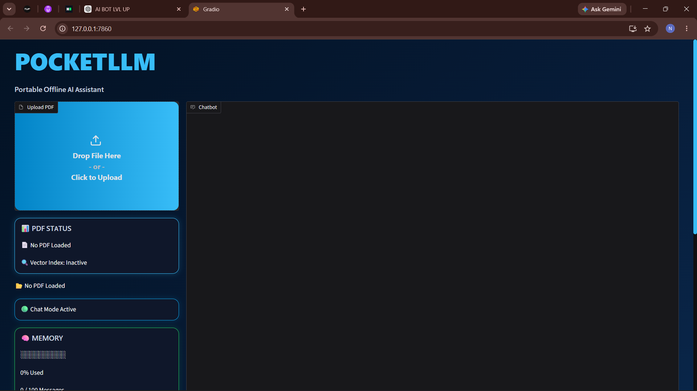
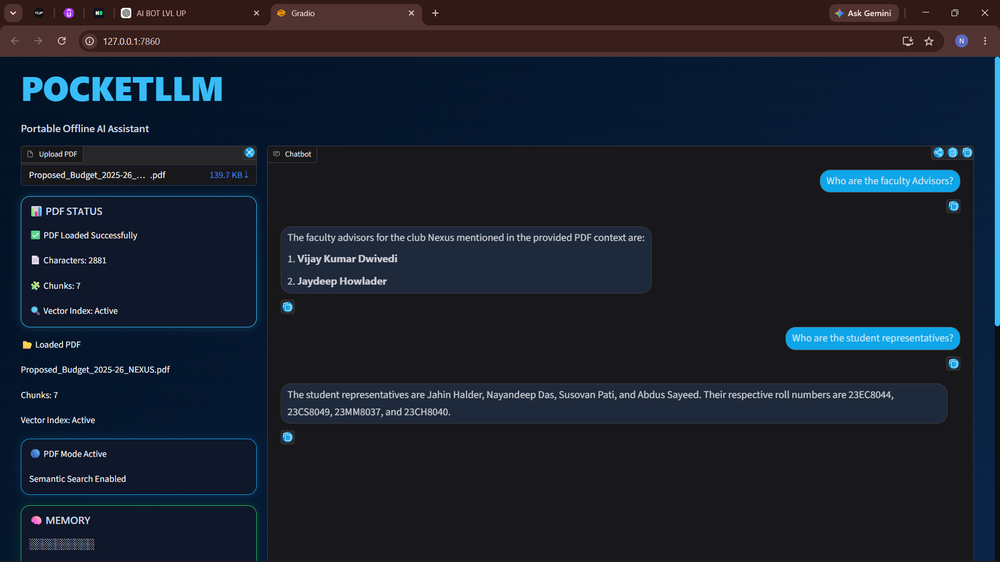
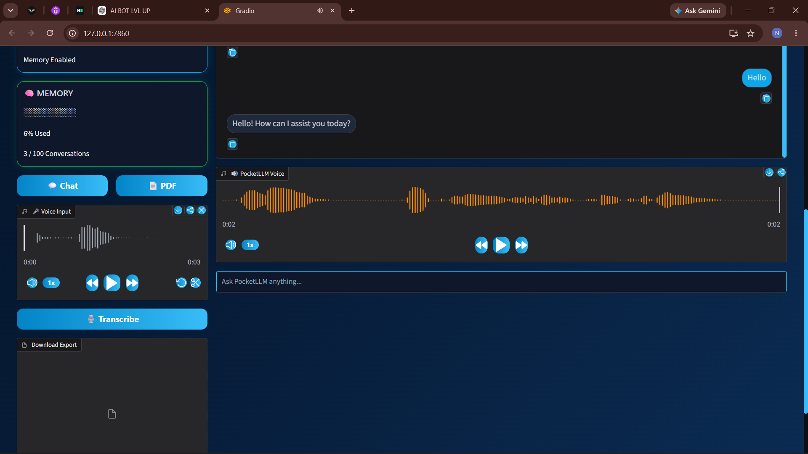
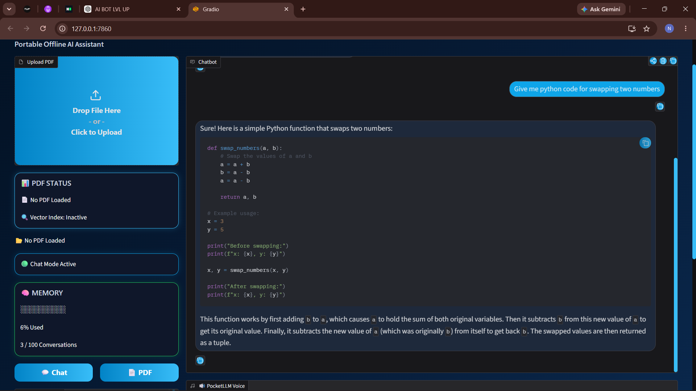

# PocketLLM

### Portable Offline AI Assistant with RAG and Voice Interaction

PocketLLM is a fully offline AI assistant built using local AI models. It combines conversational AI, PDF Question Answering, Speech-to-Text, Text-to-Speech, and Retrieval-Augmented Generation (RAG) into a single portable application.

---

## Features

* Offline Conversational AI using Qwen 2.5 1.5B
* PDF Question Answering using FAISS Vector Search
* Voice Input using Faster-Whisper
* Voice Output using Piper TTS
* Persistent Chat Memory
* Chat Export Functionality
* Custom Ocean Blue Gradio UI
* Fully Offline Deployment
* Portable Folder-Based Architecture

---

## Screenshots

### Home Screen



### PDF Question Answering



### Voice Interaction



### Chat Mode



---

## Tech Stack

### AI Models

* Qwen2.5-1.5B-Instruct
* all-MiniLM-L6-v2
* Faster-Whisper (Base)
* Piper TTS

### Libraries

* Transformers
* SentenceTransformers
* FAISS
* Gradio
* PyTorch
* Faster-Whisper
* Piper-TTS

---

## Architecture

User Input
↓
Qwen 2.5 LLM
↓
Response Generation

PDF Upload
↓
Text Extraction
↓
Chunking
↓
MiniLM Embeddings
↓
FAISS Vector Search
↓
Relevant Context Retrieval
↓
Qwen Response Generation

Voice Input
↓
Whisper STT
↓
Qwen
↓
Piper TTS
↓
Audio Response

---

## Project Structure

PocketLLM/

├── app.py

├── README.md

├── requirements.txt

├── exports/

├── assets/

└── models/

    ├── qwen/

    ├── all-MiniLM-L6-v2/

    ├── whisper/

    └── piper_models/

---

## How It Works

1. User enters text or voice input.
2. Qwen generates responses locally.
3. PDFs are processed into chunks.
4. MiniLM generates vector embeddings.
5. FAISS retrieves relevant document context.
6. Whisper converts speech to text.
7. Piper converts responses to speech.

---

## Installation

```bash
pip install -r requirements.txt
```

---

## Run

```bash
python app.py
```

Open:

```text
http://127.0.0.1:7860
```

---

## System Requirements

* Windows 10/11
* Python 3.11+
* NVIDIA GPU (recommended)
* 8 GB+ RAM
* Local model files downloaded

---

## Future Improvements

* Multi-PDF Retrieval
* Advanced Memory Management
* Conversation Summarization
* Improved RAG Retrieval
* Executable Packaging
* GPU Optimizations

---

## Author

Nayandeep Das

B.Tech, Computer Science & Engineering

National Institute of Technology Durgapur
